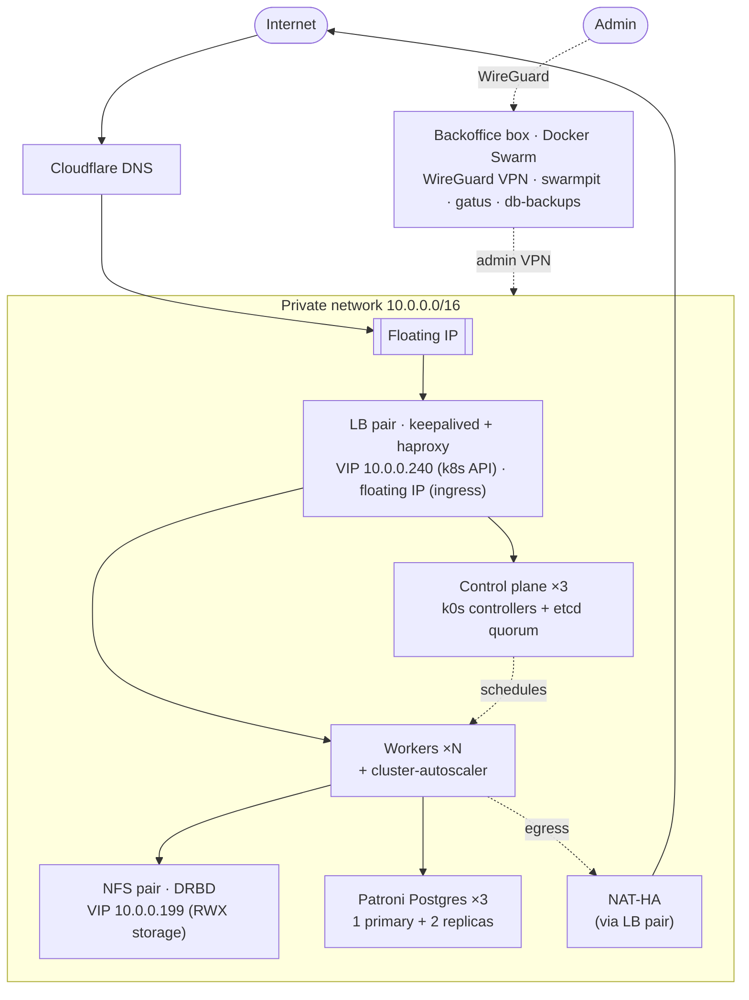

# Highly available k0s cluster boilerplate

> by [@misterkuka](https://github.com/misterkuka)

A batteries-included, **fully HA** Kubernetes ([k0s](https://k0sproject.io/)) cluster on
[Hetzner Cloud](https://www.hetzner.com/cloud), provisioned end-to-end as code: **Terraform** for the
infrastructure, **Ansible** for the cluster + stateful HA, and **ArgoCD** (app-of-apps) for everything
running inside. No single node can take the cluster down.

Everything is parameterized and ships with `.example` placeholders — **no real secrets in this repo**.
Fill them in, set your `domain`, and `terraform apply`.

> **⚡ Don't want to run it yourself?** We operate this stack for you — provisioning, upgrades, backups,
> and **24/7 monitoring** — from **$399/mo** on top of Hetzner's (already low) server cost. See
> **[Managed service](#managed-service)**.

---

## Architecture



<details>
<summary>ASCII fallback</summary>

```
                Internet
                   │
            Cloudflare DNS
                   │
              Floating IP
                   │
   ┌───────────────┴───────────────────────── private net 10.0.0.0/16 ──┐
   │   LB pair (keepalived + haproxy)                                    │
   │   VIP 10.0.0.240 = k8s API · floating IP = ingress                  │
   │        │                         │                                  │
   │  control plane ×3           workers ×N ── cluster-autoscaler        │
   │  (etcd quorum)                   │                                  │
   │                          ┌───────┼─────────┐                        │
   │                   NFS pair (DRBD)   Patroni Postgres ×3   NAT-HA     │
   │                   VIP 10.0.0.199    1 primary + 2 replica  (egress)  │
   └────────────────────────────────────────────────────────────────────┘
        ▲ admin VPN
   Backoffice box (Docker Swarm): WireGuard · swarmpit · gatus · db-backups
```
</details>

## How HA is covered

Every layer removes a single point of failure. The "Implemented in" column points at the code.

| Layer | SPOF removed by | Survives | Implemented in |
|---|---|---|---|
| **Control plane** | 3 k0s controllers + etcd quorum behind VIP `10.0.0.240` | 1 controller down | `ansible/playbooks/k0s_main` |
| **Ingress / API LB** | LB pair, keepalived owns the floating IP + API VIP | 1 LB node down | `ansible/playbooks/loadbalancer` |
| **Workers** | N workers + Hetzner cluster-autoscaler | node loss / load spikes | `gitops/base/cluster-autoscaler` |
| **Storage (RWX)** | DRBD NFS pair, keepalived alias-IP `10.0.0.199`, diskless tiebreaker for quorum | 1 NFS node down | `ansible/playbooks/nfs/nfs_ha` |
| **Database** | 3-node Patroni (1 primary + 2 replicas), automatic failover | primary loss | `ansible/playbooks/postgres` |
| **Database (data loss)** | pgBackRest: continuous WAL archiving to object storage, ~60s RPO, PITR | `DROP TABLE`, bad migration — the things replicas faithfully copy | `ansible/playbooks/postgres` |
| **DNS** | Cloudflare as-code, low TTL | record drift / fast cutover | `terraform/cloudflare.tf` |
| **Egress (NAT)** | NAT-HA on the LB pair (route → `10.0.0.210`) | NAT node down | `ansible/playbooks/loadbalancer` |
| **GitOps** | ArgoCD self-heal + app-of-apps | config drift / manual change | `gitops/` |
| **Admin access** | WireGuard bastion to the private net | — | `ansible/playbooks/backoffice` |

## What's inside

```
up           one command to build the whole thing (or any single step) — see docs/BUILD.md
terraform/   Hetzner servers/network/volumes/floating IPs + Cloudflare DNS  (+ backups/ for the backup bucket)
ansible/     k0s install, LB/keepalived, DRBD NFS, Patroni Postgres + pgBackRest, WireGuard, node tuning
gitops/      ArgoCD app-of-apps: sealed-secrets, traefik, nfs-provisioner, cluster-autoscaler,
             monitoring (Prometheus/Grafana/Alertmanager), hyperdx + otel logs, tetragon, keydb,
             db-access, gatus, woodpecker CI
backoffice/  Docker-Swarm management box: WireGuard VPN, swarmpit, gatus, db_lb, traefik
docs/        BUILD.md (full runbook) · ADDING_NEW_SERVICE.md
```

## Topology (defaults, all in `terraform/main.tf`)

3 controllers · N workers (+ autoscaled burst pool) · 3 Postgres (Patroni) · 2 NFS (DRBD) ·
2 LB (keepalived) · 1 backoffice/NAT box. Private network `10.0.0.0/16`; IP plan: managers `.3–.49`,
workers `.50–.99`, db `.100–.149`, backoffice `.150`, nfs `.200–.209`, lb `.210–.211`.

## Before you start

1. Replace **`example.com`** with your domain (global find/replace) — or just set `var.domain` in
   Terraform; the in-cluster manifests use `example.com` as the placeholder host.
2. Fill the `.example` files: `terraform/secrets.auto.tfvars`, `terraform/terraform.tfvars`,
   `ansible/inventory`, `ansible/playbooks/loadbalancer/secrets.yml`, `backoffice/.sops.yaml` + age key.
3. Drop your SSH public key in `terraform/ssh_keys/admin.pub`.
4. Generate a fresh Sealed-Secrets sealing key and **reseal** the placeholder `sealedsecret.yaml`
   files — they contain no real secret (`gitops/certs/README.md`).

## Bootstrap

```bash
./up
```

That's the whole thing. It asks for the three secrets it can't generate — a Hetzner API token, a
Cloudflare API token, and Hetzner Object Storage keys — generates everything else (SSH keypair, VRRP
password, backup cipher passphrase), and builds the cluster. You also need a domain whose Cloudflare
zone already exists.

Each step is individually re-runnable (`./up k0s`), so a failure resumes rather than starting over.

```
init  → check      preflight: tools, config, tokens — before anything is provisioned
      → infra      terraform apply: servers, network, volumes, floating IPs, DNS
      → inventory  ansible/inventory rendered from terraform state (no hand-copied IPs)
      → backoffice + vpn + lb
      → k0s        init → add_managers → add_workers
      → bucket     terraform/backups apply  (must precede postgres)
      → stateful   nfs_ha → postgres + pgBackRest → node tuning
      → gitops     bootstrap.sh (ArgoCD app-of-apps)
```

What each step does, and the long-form commands: **[`docs/BUILD.md`](docs/BUILD.md)**.

## What it costs — vs managed GKE / EKS / DOKS

This is the pitch. You get **managed-grade HA** — 3-node control plane, autoscaling, HA
Postgres, HA storage, LB failover — at **self-managed prices**, because Hetzner doesn't charge
a control-plane fee and its egress is effectively free. This repo is what automates the "self-managed"
part away.

Same cluster, four providers, **matched vCPU and RAM per node** (exact instance shown in each row).
On-demand, NET (ex-VAT), **730 hrs/mo**, EU regions. Hetzner prices are the official **post-June-2026**
rates (that hike renamed the shared lines: old `CPX11→CPX22`, `CX22→CX23`); €→$ at ~1.08. Hetzner rows
use the **CPX** (shared AMD) line as the fair analog to the others' shared tiers — its **CX** (Intel) and
**CAX** (Arm) lines are cheaper still (see the sub-$100 build below).

> **vCPU class matters, so it's shown.** `d` = dedicated cores, `s` = shared/burstable. Note Hetzner's
> `CCX` rows are **dedicated** while GKE's `e2` is **shared** — i.e. Hetzner is cheaper *and* gives the
> stronger vCPU class in configs B & C.

### Cheapest HA possible — 3-node, tiny shared vCPU (**under $100/mo**)

A genuinely HA k0s cluster on the smallest footprint: 3 nodes that each run the control plane **and**
workloads (etcd quorum → survives any one node), behind a single Hetzner managed Load Balancer (itself
internally redundant). This is the floor.

| Build | Region | 3× node | +LB | **Total/mo** |
|---|---|--:|--:|--:|
| 3× **CX23** · 2/4 s (Intel) | EU | €16.47 | €7.49 | **≈ $26** |
| 3× **CAX11** · 2/4 s (Arm) | EU | €17.97 | €7.49 | **≈ $27** |
| 3× **CX33** · 4/8 s (Intel) | EU | €25.47 | €7.49 | **≈ $36** |
| 3× **CPX11** · 2/4 s (AMD) | US-West (hil) | $61.47 | $8.59 | **≈ $70** |
| 3× **CPX21** · 4/8 s (AMD) | US-East (ash) | $112.47 | $8.59 | **≈ $121** |

What you trade vs the full boilerplate: Postgres runs **in-cluster** on the three nodes (no separate
Patroni tier) and storage is single-attach block volumes (no DRBD NFS RWX pair) — add those tiers as you
grow. Sub-$40 HA is **EU-only** (no Intel/Arm line in the US). The small `CPX11` is currently stocked only in
**US-West (Hillsboro)**, so a ~$70 US HA cluster is West-only; **US-East (Ashburn)** starts at the 4/8
shape (~$121) or 3× CCX13 dedicated (~$153).

### Small · non-HA (dev/staging) — 3 nodes @ **4 vCPU / 8 GB** · 1 LB · 100 GB

| Provider | Node × 3 | Ctrl plane | LB | Storage | **Total/mo** |
|---|---|---|--:|--:|--:|
| **Hetzner** | CPX32 · 4/8 s | folded into node ($0) | LB11 $8 | $5 | **≈ $129** |
| GKE | e2-custom-4-8192 · 4/8 s | free zonal ($0) | $18 | $10 | **≈ $292** |
| EKS | c6i.xlarge · 4/8 **d** | $73 (mandatory) | ALB $16 | $10 | **≈ $524** |
| DOKS | Basic · 4/8 s | free ($0) | $12 | $10 | **≈ $166** |

> On the cheaper Intel line (3× CX33) this same config is **≈ $41**. EKS can't skip its $73
> control-plane fee even non-HA.

### Medium · HA (prod baseline, ≈ this boilerplate's shape) — 4 workers @ **4 vCPU / 16 GB** + HA control plane · 2 LB · 500 GB

| Provider | Worker × 4 | HA ctrl plane | LB | Storage | **Total/mo** | vs Hetzner |
|---|---|---|--:|--:|--:|--:|
| **Hetzner** | CCX23 · 4/16 **d** | 3× CPX22 (~$63) | 2× LB11 $16 | $27 | **≈ $478** | — |
| GKE | e2-standard-4 · 4/16 s | regional $73 | 2× $37 | $50 | **≈ $590** | +23% |
| EKS | m5.xlarge · 4/16 **d** | $73 | 2× ALB $33 | $48 | **≈ $825** | **+73%** |
| DOKS | GP · 4/16 **d** | +$40 | 2× $24 | $50 | **≈ $618** | +29% |

### Large · HA — 8 workers @ **8 vCPU / 32 GB** + HA control plane · 3 LB · 2 TB

| Provider | Worker × 8 | HA ctrl plane | LB | Storage | **Total/mo** | vs Hetzner |
|---|---|---|--:|--:|--:|--:|
| **Hetzner** | CCX33 · 8/32 **d** | 3× CPX32 (~$115) | 3× LB11 $24 | $108 | **≈ $1,444** | — |
| GKE | e2-standard-8 · 8/32 s | regional $73 | 3× $55 | $200 | **≈ $2,050** | +42% |
| EKS | m5.2xlarge · 8/32 **d** | $73 | 3× ALB $49 | $190 | **≈ $2,999** | **+108%** |
| DOKS | GP · 8/32 **d** | +$40 | 3× $36 | $200 | **≈ $2,292** | +59% |

### Hetzner EU vs US — same cluster, two regions

Hetzner's US locations (Ashburn / Hillsboro) are pricier — and the gap is *structural*, not just FX:

| | EU (fsn / nbg / hel) | US-West (hil) | US-East (ash) |
|---|--:|--:|--:|
| Cheapest shared shape | **CX23** €5.49 · **CAX11** €5.99 | **CPX11** $20.49 | CPX21 $37.49 (no CPX11) |
| Dedicated CCX23 (4/16) | €85.99 (~$93) | $102.99 (+11%) | $102.99 (+11%) |
| Cheapest 3-node HA | **~$26** | **~$70** | ~$121 |
| Medium-HA config total | **~$478** | **~$516** | **~$516** |
| **Included traffic / server** | **20 TB** | **1 TB** | **1 TB** |

Both US sites price CPX/CCX identically and include only **1 TB** traffic/server (vs 20 TB in the EU).
Two things vary: the small **`CPX11`** is currently stocked in **Hillsboro (West)** but not **Ashburn
(East)**, so the sub-$100 US HA floor is West-only; and the cheap **Intel/Arm (CX/CAX)** lines stay
**EU-exclusive**. Stay in the EU unless you need US latency — and if you do, pick the West for the
cheapest footprint.

### …then egress makes it a rout

The tables above are *before traffic*. Push **5 TB/mo** outbound — a modest API/app load — and the
gap explodes:

| | Hetzner (EU) | DOKS | GKE | EKS |
|---|--:|--:|--:|--:|
| Egress on 5 TB/mo | **$0** | **$0** | ≈ $600 | ≈ $450 |

Hetzner EU includes **20 TB per server** (overage €1/TB); DigitalOcean pools a free multi-TB allotment.
GKE bills **$0.12/GB** and EKS **$0.09/GB** — so on a busy prod cluster egress alone can cost more than
the entire Hetzner bill. (In US Hetzner regions the included allotment drops to 1 TB/server — still far
above the hyperscalers' zero.)

**The honest asterisks:** (1) "managed" clusters give you a vendor-run, SLA-backed control plane — here
*you* own the three controllers, but Terraform + Ansible + ArgoCD in this repo stand them up and keep
them healed, so the operational delta is small and the savings are not. (2) Prices are provider list
rates as of 2026 (Hetzner = official post-June-2026 adjustment doc); the hyperscalers drop 30–60% under
1–3yr commitments/savings plans, which Hetzner doesn't require because its list price is already lower.
(3) GKE's `e2` rows are shared-vCPU; matching Hetzner's dedicated `CCX` with GKE `n2`/`c2` widens the
gap further. Track your real bill with **[hetzner-cost-monitor](https://github.com/prehoy/hetzner-cost-monitor)**.

> **Those numbers are yours to check.** If you'd rather we ran them against your actual bill and
> cluster, that's the **[$600 audit](https://prehoy.com/services/)** — fixed scope, 4 hours, and the
> report is yours to keep whether or not you move.

## Managed service

Prefer to skip the ops entirely? We run this cluster for you — the same fully-HA stack, operated as a
service: provisioning, k0s/ArgoCD upgrades, backups, security patching, and **24/7 monitoring** off the
Prometheus / Grafana / Alertmanager / gatus observability that's already baked in. You pay the Hetzner
server + traffic bill (at cost, shown above) **plus** a flat management fee:

| Tier | Price/mo | Response | Best for | Included |
|---|--:|---|---|---|
| **Standard** | **$399** | automated 24/7 alerting · business-hours human response | staging, internal tools, small prod | patching, backups, GitOps deploys, ≤5 nodes |
| **Pro** | **$999** | true 24/7 on-call · 15-min P1 ack · 99.9% target | business-critical prod HA | incident response, monthly review, ≤12 nodes, +$50/node beyond |
| **Enterprise** | **from $2,500** | 99.95% · 5-min ack · named contact · DR drills | regulated / multi-cluster | compliance support, on-call rotation, custom SLA |

- **Infrastructure is passed through at Hetzner cost** — no markup on servers or traffic. The fee buys
  operations, not resold compute.
- **One-time onboarding: $1,500–3,000** — cluster provisioning, migration, and handover.
- Fully managed, a prod HA cluster runs **~$1,477/mo all-in** (Pro tier + Medium-HA infra). The same
  cluster is **≈$825/mo of EKS infra before anyone runs it** — and someone has to. A senior DevOps hire
  is **~$9,000/mo** fully loaded (€86k average gross, [Glassdoor DE](https://www.glassdoor.com/Salaries/germany-senior-devops-engineer-salary-SRCH_IL.0,7_IN96_KO8,30.htm), Jan 2026, plus ~20% employer
  contributions), which puts the honest comparison at **~$9,825/mo vs ~$1,477/mo**.

### Not ready to hand over production? Start with the audit.

**$600, fixed scope, 4 hours.** We read your cluster and your actual cloud bill, then hand you a short
report that ends in a number: what you pay now, what the same workload costs on Hetzner, what the
migration would take, and what we'd flag before you attempt it.

The report is yours either way — no retainer, no lock-in. If you go ahead, it's credited against
onboarding.

**[Book the audit →](https://cal.com/igor-bojczuk-xost00/devops-consulting)** ·
[prehoy.com/services](https://prehoy.com/services/) · or open an issue.

## Related projects

- **[k0s-hetzner-boilerplate-multizone](https://github.com/prehoy/k0s-hetzner-boilerplate-multizone)** —
  the same stack spread across **three EU datacenters** (survives a full-DC outage), with split LBs and
  round-robin ingress. Reach for it when a single availability zone isn't enough.
- **[hetzner-cost-monitor](https://github.com/prehoy/hetzner-cost-monitor)** — a self-hostable cost
  explorer for Hetzner Cloud (live €/hr burn, month-to-date, spend by project/type/location). Point it
  at the same project to watch what this cluster actually costs; it deploys onto the cluster you just
  built.
